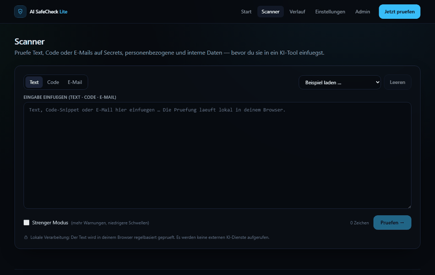
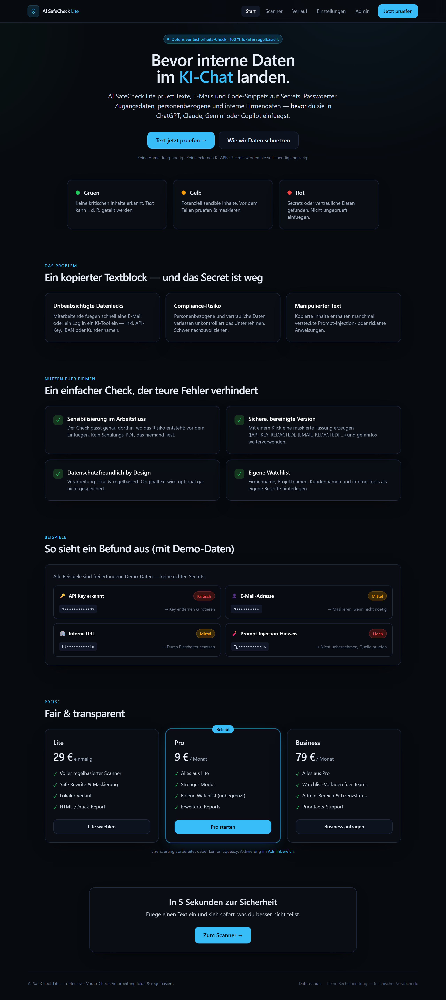
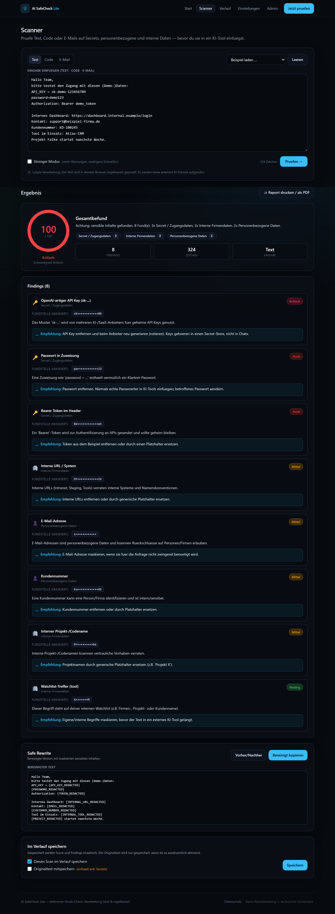
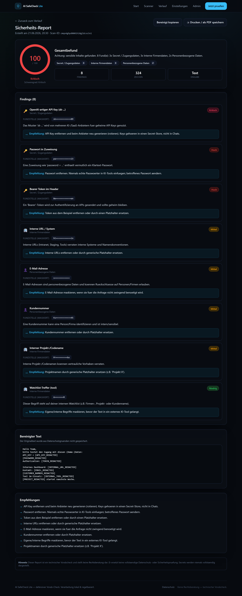
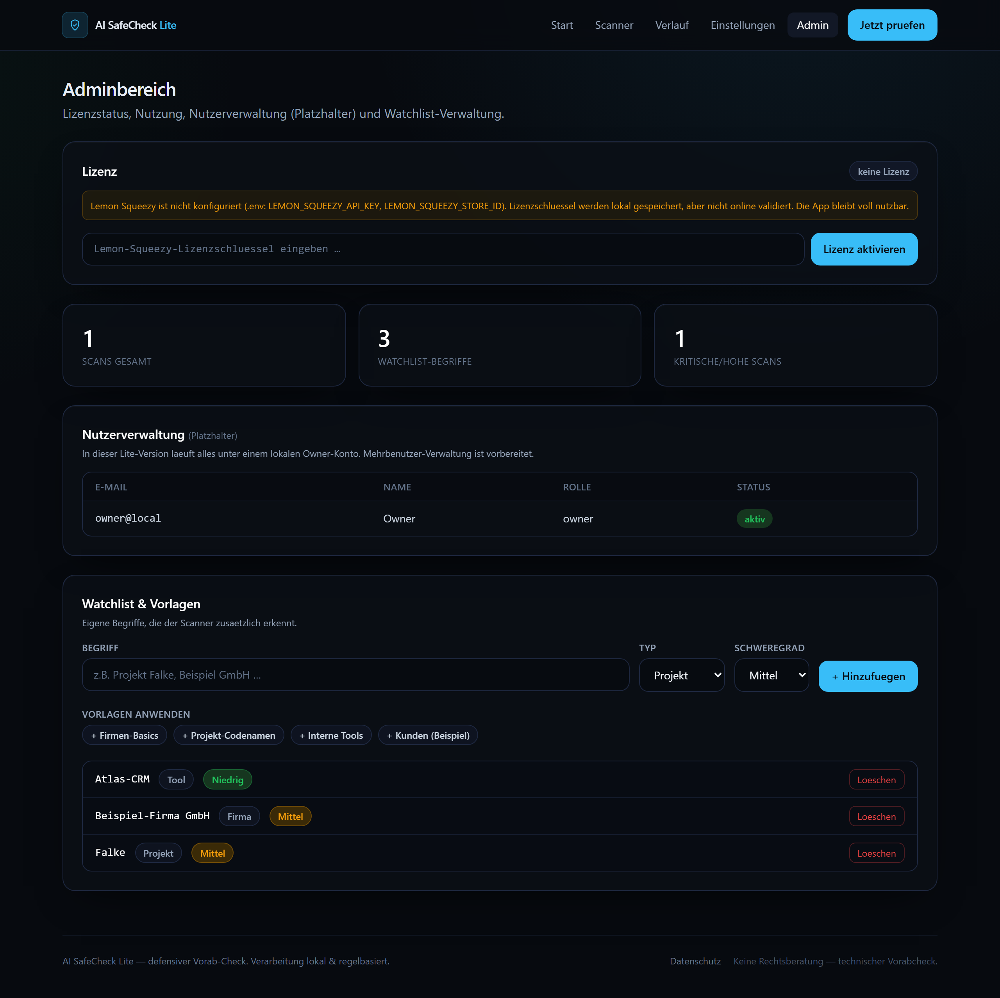

<div align="center">

# 🛡️ SafeCheck AI

### Prüfe Texte, E-Mails & Code auf sensible Daten — **bevor** sie in ChatGPT, Claude, Gemini oder Copilot landen.

Ein **rein defensiver**, regelbasierter Sicherheits-Check. Erkennt Secrets, Zugangsdaten,
personenbezogene und interne Firmendaten sowie verdächtige Prompt-Injection-Muster.
**Lokale Verarbeitung – keine externen KI-APIs.**


</div>

<div align="center">

### 🎬 Live-Demo



_Text einfügen → prüfen → Risiken sehen → bereinigte Version kopieren — alles lokal._

</div>

---

## 📌 Das Problem

Ein schnell kopierter Textblock — eine E-Mail, ein Log, ein Config-Snippet — landet im
KI-Chat. Mit dabei: ein API-Key, eine IBAN, ein Kundenname oder eine interne URL.
Solche **unbeabsichtigten Datenlecks** sind schwer nachzuvollziehen und ein echtes
Compliance-Risiko.

**SafeCheck AI** setzt genau dort an, wo das Risiko entsteht: **vor dem Einfügen.**

---

## ✨ Features

### 🔍 Scanner (Text · Code · E-Mail)
Pruefung läuft **lokal im Browser**, regelbasiert, ohne externen KI-Aufruf. Erkennt u. a.:

| Kategorie | Erkennung |
| --- | --- |
| 🔑 **Secrets** | Private Keys (PEM), AWS-Keys, OpenAI-`sk-`-Keys, GitHub-/Slack-/Google-Tokens, JWTs, Bearer-Tokens, API-Keys & Passwörter in Zuweisungen |
| 👤 **Personenbezogene Daten** | E-Mail-Adressen, Telefonnummern, IBANs (mit **Mod-97-Prüfsumme**), Kartennummern (**Luhn-Check**), Kundennummern |
| 🏢 **Interne Firmendaten** | private/öffentliche IP-Adressen, interne URLs (Intranet, Staging, Jira, GitLab …), Vertraulichkeits-Marker, Projekt-Codenamen |
| 🧨 **Prompt-Injection** | „ignore previous instructions“, System-Prompt-Manipulation, Jailbreak-Formulierungen — **nur als Warnmuster** |
| ⚠️ **Riskante Anweisungen** | Daten-Exfiltration, zerstörerische Befehle, Aufforderung zur Herausgabe von Zugangsdaten |

### 📊 Risikobewertung
- **Risk-Score 0–100** + Severity (`low` / `medium` / `high` / `critical`)
- **Ampel-System** 🟢 🟡 🔴 mit Score-Gauge
- Findings nach Kategorie gruppiert, mit Erklärung & sicherer Empfehlung
- Fundstellen werden **maskiert** angezeigt — niemals das vollständige Secret

### 🧼 Safe Rewrite
- Bereinigte Textversion mit Platzhaltern: `[API_KEY_REDACTED]`, `[EMAIL_REDACTED]`,
  `[INTERNAL_URL_REDACTED]`, `[CUSTOMER_NAME_REDACTED]` …
- **Vorher/Nachher-Ansicht** + Kopierbutton

### 📄 Report
- Druck-/PDF-Report (über die Browser-Druckfunktion)
- Zusammenfassung, Findings, Score, deduplizierte Empfehlungen, Datum
- Hinweis: „Keine Rechtsberatung — technischer Vorabcheck“

### 🕓 Verlauf & 🔐 Datenschutzmodus
- Gespeichert werden **nur Score & maskierte Findings**
- **Originaltext standardmäßig NICHT gespeichert** (opt-in pro Scan *und* global)
- Datenschutzfreundlicher Modus: Originaltext nach Scan verwerfen

### ⚙️ Einstellungen
- Originaltext speichern (ja/nein) · Strenger Modus · Verlauf an/aus

### 👁️ Eigene Watchlist
- Firmen-, Projekt-, Kunden- & Tool-Begriffe als zusätzliche Erkennung
- Fertige **Watchlist-Vorlagen** für Teams

### 🛠️ Adminbereich
- Lizenzstatus (maskierter Schlüssel) · Nutzungsstatistik
- Nutzerverwaltung (Platzhalter) · Watchlist-Verwaltung

### 💳 Lemon-Squeezy-Lizenz (vorbereitet)
- Lizenz-Aktivierung (`POST /api/license/activate`)
- Webhook-Endpoint mit **HMAC-SHA256-Signaturprüfung** (`/api/webhooks/lemon-squeezy`)
- Läuft **auch ohne** Konfiguration voll (Status `inactive`, lokal gespeichert)

---

## 📸 Screenshots

<table>
  <tr>
    <td width="50%"><b>Landingpage</b><br/></td>
    <td width="50%"><b>Scanner mit Ergebnis</b><br/></td>
  </tr>
  <tr>
    <td width="50%"><b>Report (druckbar / PDF)</b><br/></td>
    <td width="50%"><b>Adminbereich</b><br/></td>
  </tr>
</table>

---

## 🧱 Tech-Stack

**Next.js 14 (App Router)** · **TypeScript** · **Tailwind CSS** · **Prisma + SQLite** · **Zod**
Optionaler, standardmäßig deaktivierter **AI-Adapter** als vorbereitetes Interface.

---

## 🚀 Schnellstart

> Voraussetzung: **Node.js ≥ 18**

```bash
# 1) Abhängigkeiten installieren
npm install

# 2) Umgebungsvariablen anlegen
cp .env.example .env

# 3) Datenbank + Prisma-Client + Demo-Daten
npm run setup        # = prisma generate && prisma db push && tsx prisma/seed.ts

# 4) Entwicklungsserver starten
npm run dev          # → http://localhost:3000
```

### npm-Scripts

| Script | Zweck |
| --- | --- |
| `npm run dev` | Entwicklungsserver |
| `npm run build` | `prisma generate` + Production-Build |
| `npm run start` | Production-Server (nach `build`) |
| `npm run typecheck` | TypeScript-Prüfung (`tsc --noEmit`) |
| `npm run db:push` | Schema in die SQLite-DB übernehmen |
| `npm run db:seed` | Demo-Nutzer & Watchlist anlegen |
| `npm run setup` | DB + Client + Seed in einem Schritt |

Schneller Smoke-Test der Security-Engine (ohne Server):

```bash
npx tsx scripts/engine-test.ts
```

---

## 🗂️ Projektstruktur

```
src/
├── app/
│   ├── page.tsx                 # Landingpage
│   ├── scanner/                 # Scanner (lokale Prüfung im Browser)
│   ├── history/                 # Verlauf
│   ├── settings/                # Einstellungen
│   ├── admin/                   # Adminbereich (Lizenz, Stats, Watchlist)
│   ├── report/[id]/             # Druckbarer Report
│   ├── privacy/                 # Datenschutzseite
│   └── api/                     # scan · scans · settings · watchlist
│                                # license/activate · admin/overview · webhooks/lemon-squeezy
├── components/                  # UI-Komponenten (Gauge, FindingCard, SafeRewrite …)
└── lib/
    ├── security/
    │   ├── types.ts             # Typen / Vertrag
    │   ├── rules.ts             # Erkennungsregeln  ← hier erweitern
    │   ├── scanner.ts           # Orchestrierung (Dedup, Watchlist)
    │   ├── redactor.ts          # Maskierung / Safe Rewrite
    │   ├── risk-score.ts        # Risikobewertung
    │   └── test-samples.ts      # Demo-Daten (nur Dummy-Werte)
    ├── lemon-squeezy.ts · ai-adapter.ts
    └── prisma.ts · user.ts · ui.ts · validation.ts · watchlist-templates.ts
prisma/
├── schema.prisma                # User · Scan · Finding · WatchlistTerm · License · AppSettings
└── seed.ts
```

---

## 🧩 Eigene Scanner-Regeln hinzufügen

Alle Regeln liegen in [`src/lib/security/rules.ts`](src/lib/security/rules.ts) und sind
einfache Objekte:

```ts
{
  id: "secret.my_provider_key",
  title: "Mein-Provider API Key",
  category: "secret",                 // secret | pii | internal | prompt_injection | risky_instruction
  severity: "high",                   // low | medium | high | critical
  pattern: /\bmp-[A-Za-z0-9]{20,}\b/g, // Regex MIT globalem Flag (g)
  redactionTag: "[API_KEY_REDACTED]",
  explanation: "Warum das ein Risiko ist (defensiv).",
  recommendation: "Sichere Handlungsempfehlung.",
  // optional: validate, strictOnly, reveal
}
```

1. Neues Rule-Objekt ins passende Kategorie-Array einfügen
2. Eindeutige `id` + sinnvollen `redactionTag` setzen
3. `pattern` braucht **immer** das `g`-Flag
4. Mit `npx tsx scripts/engine-test.ts` testen

> **Prinzip:** Findings zeigen nie das vollständige Secret — die Maskierung übernimmt der Redactor.

---

## 💳 Lemon Squeezy einrichten (optional)

```env
LEMON_SQUEEZY_API_KEY="ls_..."
LEMON_SQUEEZY_WEBHOOK_SECRET="whsec_..."
LEMON_SQUEEZY_STORE_ID="12345"
LEMON_SQUEEZY_VARIANT_LITE="..."
LEMON_SQUEEZY_VARIANT_PRO="..."
LEMON_SQUEEZY_VARIANT_BUSINESS="..."
```

- **Lizenz aktivieren:** Adminbereich → Schlüssel eingeben (`POST /api/license/activate`)
- **Webhook:** im Lemon-Squeezy-Dashboard auf `https://DEINE-DOMAIN/api/webhooks/lemon-squeezy`
  setzen (Signatur wird per HMAC-SHA256 geprüft)

---

## 🚢 Deployment

Standard-Next.js-Projekt: `npm run build` + `npm run start`.
`DATABASE_URL` und (optional) die `LEMON_SQUEEZY_*`-Variablen als Environment-Variablen setzen.

> **SQLite-Hinweis:** ideal für lokalen/Single-Node-Betrieb. Für serverlose Plattformen mit
> flüchtigem Dateisystem (z. B. Vercel) auf eine persistente DB wechseln (Turso/libSQL,
> PostgreSQL) — dazu in `prisma/schema.prisma` den `datasource`-Provider anpassen.

---

## 🔒 Sicherheit & Datenschutz

- **Rein defensiv:** kein Angriffscode, keine Exploits, keine Umgehungstechniken.
  Prompt-Injection & riskante Anweisungen werden ausschließlich als **Warnmuster** erkannt.
- **Lokale Verarbeitung:** der Scan läuft regelbasiert im Browser.
- **Secrets werden nie vollständig dargestellt** (z. B. `sk••••••89`).
- **Standardmäßig kein Originaltext** in der Datenbank.
- Alle Beispiel-/Demodaten sind **frei erfundene Dummy-Werte**.

> ⚖️ **Kein Rechtsbeistand:** SafeCheck AI ist ein technischer Vorabcheck und ersetzt keine
> vollständige Datenschutz-/Sicherheitsprüfung.

---

## 📜 Lizenz

MIT — siehe [`LICENSE`](LICENSE).
